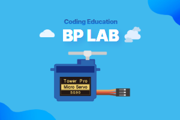

# Servo 360 Extension for MakeCode



This extension allows you to control a 360-degree continuous rotation servo motor with the micro:bit.

## 🚀 Features

- Easy control of 360-degree continuous rotation servo motors
- Support for both full-speed and variable-speed rotation
- Simple blocks for motor control in both directions
- Ability to turn off motor to save power
- Can be registered as a MakeCode extension for easy use
- Support for Korean

## Blocks

### 🔍 Summary: What each block does

| **Block ID**                 | **Function**                                   |
|-----------------------------|-----------------------------------------------|
| [`spinOneWay`](#1-spin-one-way-block) | Spin motor in one direction at full speed |
| [`spinOtherWay`](#2-spin-other-way-block) | Spin motor in opposite direction at full speed |
| [`spinOneWayWithSpeed`](#3-spin-one-way-with-speed-block) | Spin motor in one direction with variable speed |
| [`spinOtherWayWithSpeed`](#4-spin-other-way-with-speed-block) | Spin motor in opposite direction with variable speed |
| [`turnOffMotor`](#5-turn-off-motor-block) | Turn off the motor |

### 1. Spin One Way Block

```typescript
//% blockId='spinOneWay' block="spin one way pin %pin"
export function spinOneWay(pin = AnalogPin.P1): void
```

- 🔹 Description
  - Spins the servo motor in one direction at full speed
  - Default pin is P1

- ✅ Usage example
  ```typescript
  servo360.spinOneWay(AnalogPin.P1) // Spin motor at full speed
  ```

### 2. Spin Other Way Block

```typescript
//% blockId='spinOtherWay' block="spin other way pin %pin"
export function spinOtherWay(pin = AnalogPin.P1): void
```

- 🔹 Description
  - Spins the servo motor in the opposite direction at full speed
  - Default pin is P1

- ✅ Usage example
  ```typescript
  servo360.spinOtherWay(AnalogPin.P1) // Spin motor in opposite direction
  ```

### 3. Spin One Way With Speed Block

```typescript
//% blockId='spinOneWayWithSpeed' block="spin one way pin %pin | with speed %speed"
export function spinOneWayWithSpeed(pin = AnalogPin.P1, speed = 50): void
```

- 🔹 Description
  - Spins the motor in one direction with variable speed
  - Speed range: 0 to 100
  - Default pin is P1, default speed is 50

- ✅ Usage example
  ```typescript
  servo360.spinOneWayWithSpeed(AnalogPin.P1, 75) // Spin at 75% speed
  ```

### 4. Spin Other Way With Speed Block

```typescript
//% blockId='spinOtherWayWithSpeed' block="spin other way pin %pin | with speed %speed"
export function spinOtherWayWithSpeed(pin = AnalogPin.P1, speed = 50): void
```

- 🔹 Description
  - Spins the motor in the opposite direction with variable speed
  - Speed range: 0 to 100
  - Default pin is P1, default speed is 50

- ✅ Usage example
  ```typescript
  servo360.spinOtherWayWithSpeed(AnalogPin.P1, 25) // Spin opposite way at 25% speed
  ```

### 5. Turn Off Motor Block

```typescript
//% blockId='turnOffMotor' block="turn off motor at pin %pin"
export function turnOffMotor(pin = AnalogPin.P1): void
```

- 🔹 Description
  - Turns off the motor at the specified pin
  - Default pin is P1

- ✅ Usage example
  ```typescript
  servo360.turnOffMotor(AnalogPin.P1) // Turn off the motor
  ```

## 📜 License

MIT License

## 💡 About BPLab

BPLab is a specialized company that provides coding education that anyone can easily learn. We provide in-person and online coding education for children, teens, adults, institutions, organizations, small groups, and schools in Korea in various fields such as IoT, artificial intelligence, micro:bit and Arduino.

We are also leading the way in developing and distributing coding education kits that allow learners to build, program, and experience the principles of coding. These kits utilize microcontrollers such as Arduino and micro:bit, as well as various sensors. This micro:bit extension is available for use in courses taught by BPLab.

Visit our websites:

- Korea: https://bplab.kr
- Global: https://bplab-us.com
- Japan: https://bplab-jp.com

---

> Open this page at [https://bplab-dev.github.io/pxt-bplab-servo-360/](https://bplab-dev.github.io/pxt-bplab-servo-360/)

## Use as Extension

This repository can be added as an **extension** in MakeCode.

* open [https://makecode.microbit.org/](https://makecode.microbit.org/)
* click on **New Project**
* click on **Extensions** under the gearwheel menu
* search for **https://github.com/bplab-dev/pxt-bplab-servo-360** and import

## Edit this project

To edit this repository in MakeCode.

* open [https://makecode.microbit.org/](https://makecode.microbit.org/)
* click on **Import** then click on **Import URL**
* paste **https://github.com/bplab-dev/pxt-bplab-servo-360** and click import

#### Metadata (used for search, rendering)

* for PXT/microbit

<script src="https://makecode.com/gh-pages-embed.js"></script><script>makeCodeRender("{{ site.makecode.home_url }}", "{{ site.github.owner_name }}/{{ site.github.repository_name }}");</script>
